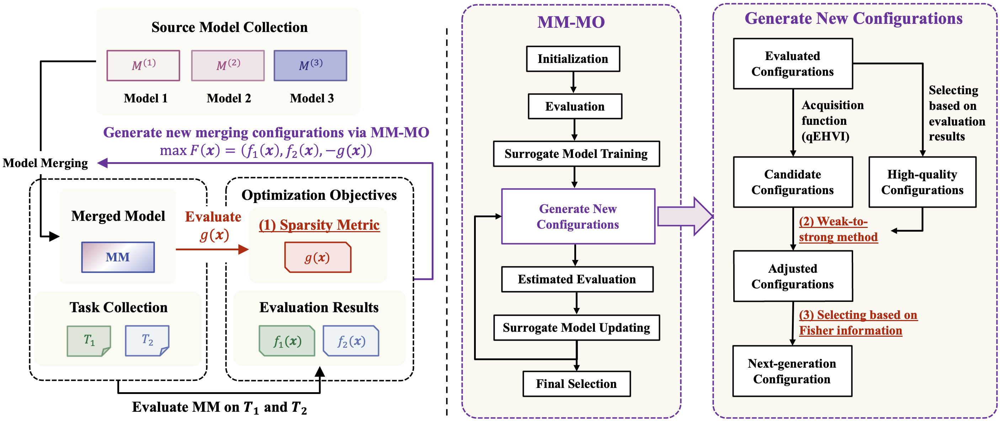

<h1 align="center"> It’s Morphing Time: Unleashing the Potential of Multiple LLMs via Multi-Objective Optimization </h1>

This repository includes the code for the paper “_**It’s Morphing Time: Unleashing the Potential of Multiple LLMs via Multi-Objective Optimization**_”, which has been accepted at **IEEE Transactions on Evolutionary Computation**. The paper is available at: https://ieeexplore.ieee.org/abstract/document/11177252

## 💥 News 💥

- 🎉🎉🎉 **[Sep 17, 2025]** Our paper is accepted at IEEE Transactions on Evolutionary Computation! The camera ready version is coming soon.

## Overview



## 🚧 Code Coming Soon! 🚧

## Citation

If you find our work helpful, please cite the following BibTeX entry:

```
@ARTICLE{11177252,
  author={Li, Bingdong and Di, Zixiang and Yang, Yanting and Qian, Hong and Yang, Peng and Hao, Hao and Tang, Ke and Zhou, Aimin},
  journal={IEEE Transactions on Evolutionary Computation}, 
  title={It’s Morphing Time: Unleashing the Potential of Multiple LLMs via Multi-Objective Optimization}, 
  year={2025},
  volume={},
  number={},
  pages={1-1},
  keywords={Merging;Optimization;Adaptation models;Computational modeling;Data models;Training data;Interference;Overfitting;Measurement;Training;Large language model;model merging;multi-objective optimization},
  doi={10.1109/TEVC.2025.3613937}}
```